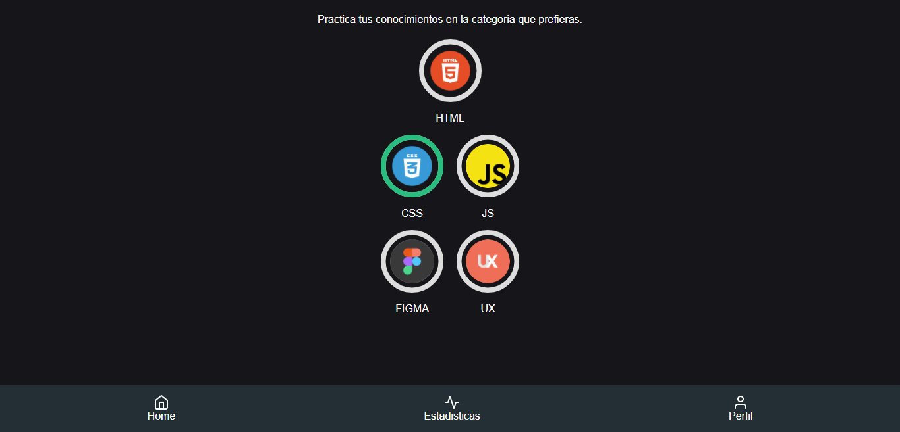
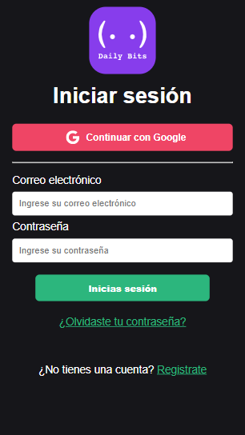

# 💎 Daily Bits

Las lecciones de Daily Bits se adaptan a tu estilo de aprendizaje. Los ejercicios están diseñados a tu medida para ayudarte a aprender y repasar tus conocimientos de programación y diseño.


 Puedes ver nustro despliegue aquí: [Daily Bits Web](https://daily-bits-react.netlify.app/)
 Puedes ver el código en nuestro repositorio: [Daily Bits Repositorio](https://github.com/migueljalvarez/daily-bits)

## Requerimientos

Para poder ejecutar la aplicación en local debes instalar [NodeJs](https://nodejs.org)

## 🔥 Instalación

En la carpeta de la aplicación teniendo previamente instalado [NodeJs](https://nodejs.org) ejecuta el siguiente comando en tu terminal para instalar los módulos necesarios

```shell
npm install
```

Teniendo los módulos instalados es momento de iniciar la aplicacion. Para ello ejecuta el comando:

```shell
npm start
```

## 🔍 Vistas 

### 💻 Desktop



### 📱 Mobile



## 📌 Stack

<escribe aquí>

## 🌟 Autores

* **Miguel Alvarez**  - [@migueljalvarez](https://github.com/migueljalvarez)
* **Giselle Arte**  - [@Gisellea198](https://github.com/Gisellea198)
* **Omar Palenzuela**  - [@OJPalenzuela](https://github.com/OJPalenzuela)
